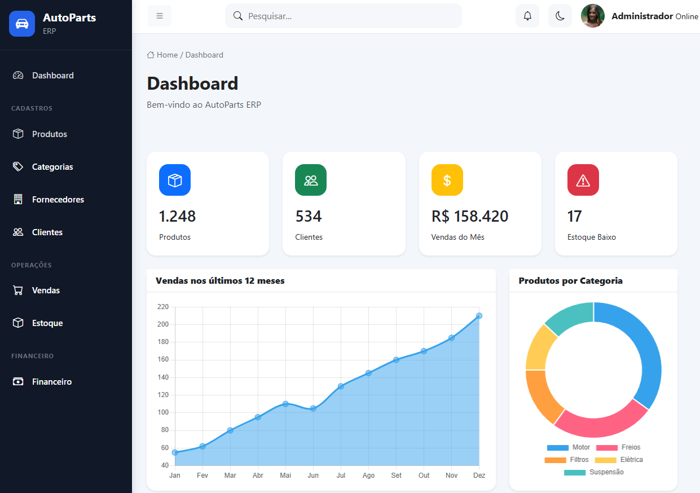

<div align="center">

# 🚗 AutoParts ERP

### Sistema de gestão para autopeças desenvolvido com ASP.NET Core 9


Sistema ERP em desenvolvimento para gerenciamento de uma empresa de autopeças, com foco em arquitetura de software, regras de negócio, qualidade de código, testes automatizados, observabilidade, containerização e práticas modernas de desenvolvimento .NET.

</div>

---

# 📖 Sobre o Projeto

O **AutoParts ERP** é uma aplicação desenvolvida em **ASP.NET Core 9 MVC**, simulando um sistema utilizado por empresas do segmento de autopeças.

O projeto foi criado com foco não apenas na implementação das funcionalidades, mas também na aplicação de práticas utilizadas em ambientes profissionais de desenvolvimento de software.

Entre os principais conceitos aplicados estão:

* Arquitetura em camadas
* Repository Pattern
* Service Layer
* Dependency Injection
* SOLID
* Entity Framework Core
* ASP.NET Core Identity
* Validação de regras de negócio
* Tratamento de exceções
* Testes automatizados
* Logging estruturado
* Health Checks
* Docker
* SQL Server
* GitHub Actions
* CI

O projeto continuará evoluindo para incorporar mensageria, processamento assíncrono, observabilidade avançada, Kubernetes e serviços de nuvem.

---

# 🎯 Objetivos

O AutoParts possui dois objetivos principais.

## Sistema

Construir uma base para um ERP de autopeças contemplando:

* Produtos
* Categorias
* Marcas
* Estoque
* Clientes
* Fornecedores
* Compras
* Vendas
* Financeiro
* Relatórios
* Dashboard

## Engenharia de Software

Utilizar o projeto como laboratório para práticas modernas de desenvolvimento:

* Clean Code
* SOLID
* Design Patterns
* Testes automatizados
* CI/CD
* SonarQube
* Mensageria
* Worker Services
* IBM MQ
* OpenTelemetry
* Prometheus
* Grafana
* ELK
* Kubernetes
* Azure

---

# ✨ Funcionalidades

## 🔐 Autenticação

* ASP.NET Core Identity
* Login
* Logout
* Controle de acesso
* Redirecionamento para login
* Página de acesso negado
* Cookie de autenticação
* Expiração e renovação de sessão

---

## 📦 Produtos

* Cadastro de produtos
* Edição de produtos
* Exclusão de produtos
* Listagem de produtos
* Categorias
* Marcas
* Controle de estoque
* Estoque mínimo
* Preço de compra
* Preço de venda
* Localização
* Observações
* Ativação/desativação
* Validação de código único

### Regras de negócio

O cadastro de produtos possui validações como:

* Código obrigatório
* Descrição obrigatória
* Categoria obrigatória
* Marca obrigatória
* Preço de venda maior que zero
* Preço de venda não pode ser inferior ao preço de compra
* Código do produto não pode ser duplicado

Além da validação na aplicação, o banco de dados possui uma **restrição de unicidade** para o código do produto.

---

# 🧪 Testes Automatizados

O projeto possui uma suíte de testes unitários utilizando:

* **xUnit**
* **Moq**
* **FluentAssertions**

Atualmente existem **22 testes automatizados** cobrindo principalmente as regras de negócio do `ProdutoService`.

Os testes contemplam cenários como:

* Criação de produtos
* Validação de código
* Validação de descrição
* Validação de categoria
* Validação de marca
* Validação de preços
* Código duplicado
* Atualização de produtos
* Atualização mantendo o próprio código
* Produto inexistente
* Exclusão de produtos
* Falhas do repositório
* Propagação de exceções

Para executar os testes:

```bash
dotnet test
```

Resultado atual:

```text
Total: 22
Falhas: 0
Sucesso: 22
Ignorados: 0
```

---

# 📊 Cobertura de Código

A cobertura pode ser gerada através do coletor de cobertura do .NET:

```bash
dotnet test --collect:"XPlat Code Coverage"
```

A análise atual do `ProdutoService` apresenta aproximadamente:

| Métrica         | Cobertura |
| --------------- | --------: |
| Line Coverage   |   **90%** |
| Branch Coverage |   **96%** |

A cobertura global do projeto ainda é menor porque diversas áreas da aplicação ainda estão em desenvolvimento.

O objetivo não é aumentar a cobertura artificialmente, mas garantir que as principais regras de negócio possuam testes relevantes.

---

# 🏗 Arquitetura

A solução utiliza uma arquitetura organizada em camadas, separando responsabilidades entre apresentação, domínio, acesso a dados e serviços.

```text
AutoParts
│
├── .github
│   └── workflows
│       └── ci.yml
│
├── src
│   │
│   ├── AutoParts.sln
│   │
│   ├── AutoParts
│   │   │
│   │   ├── Controllers
│   │   ├── Data
│   │   ├── Models
│   │   ├── Repositories
│   │   │   ├── Interfaces
│   │   │   └── Implementations
│   │   ├── Services
│   │   │   ├── Interfaces
│   │   │   ├── Implementations
│   │   │   └── Exceptions
│   │   ├── ViewModels
│   │   ├── Views
│   │   ├── Program.cs
│   │   └── appsettings.json
│   │
│   └── AutoParts.Tests
│       │
│       └── Services
│
├── docker-compose.yml
├── Dockerfile
└── README.md
```

---

# 🔄 Fluxo da Aplicação

A aplicação utiliza o seguinte fluxo para operações de negócio:

```text
Controller
    │
    ▼
Service
    │
    ├── Valida regras de negócio
    │
    ├── Trata exceções de negócio
    │
    ▼
Repository
    │
    ▼
Entity Framework Core
    │
    ▼
SQL Server
```

Essa separação mantém as regras de negócio fora dos Controllers e facilita a realização de testes unitários.

---

# 🛠 Tecnologias

| Tecnologia            | Utilização            |
| --------------------- | --------------------- |
| .NET 9                | Plataforma            |
| ASP.NET Core MVC      | Aplicação Web         |
| Entity Framework Core | ORM                   |
| SQL Server 2022       | Banco de dados        |
| ASP.NET Core Identity | Autenticação          |
| Bootstrap             | Interface             |
| xUnit                 | Testes automatizados  |
| Moq                   | Mock de dependências  |
| FluentAssertions      | Asserções dos testes  |
| Serilog               | Logging estruturado   |
| Seq                   | Visualização dos logs |
| Health Checks         | Monitoramento         |
| Docker                | Containerização       |
| Docker Compose        | Orquestração local    |
| GitHub Actions        | CI                    |
| Git                   | Controle de versão    |

---

# 🗄 Banco de Dados

O projeto utiliza **SQL Server 2022** através do Entity Framework Core.

As alterações de banco são controladas por migrations.

Criar uma migration:

```bash
dotnet ef migrations add NomeDaMigration
```

Aplicar migrations:

```bash
dotnet ef database update
```

O código do produto possui índice único:

```text
IX_Produtos_Codigo
```

garantindo que dois produtos não possam possuir o mesmo código no banco de dados.

---

# 🐳 Docker

O ambiente de desenvolvimento possui uma composição Docker contendo:

```text
┌──────────────────────────┐
│      AutoParts Web       │
│     ASP.NET Core 9       │
│        :8080             │
└────────────┬─────────────┘
             │
       ┌─────┴─────┐
       ▼           ▼
┌─────────────┐ ┌─────────────┐
│ SQL Server  │ │     Seq     │
│    :1433    │ │    :5341    │
└─────────────┘ └─────────────┘
```

## Pré-requisitos

* Docker Desktop
* .NET 9 SDK
* Git

---

# 🚀 Executando com Docker

Na raiz do projeto:

```bash
docker compose up -d
```

Serviços:

| Serviço        |  Porta | Descrição              |
| -------------- | :----: | ---------------------- |
| 🚗 AutoParts   | `8080` | Aplicação ASP.NET Core |
| 🗄️ SQL Server | `1433` | Banco de dados         |
| 📊 Seq         | `5341` | Logs estruturados      |

Aplicação:

```text
http://localhost:8080
```

Seq:

```text
http://localhost:5341
```

---

# 🐳 Atualizando a Aplicação Docker

O projeto utiliza publicação manual da aplicação antes da construção da imagem.

```powershell
Remove-Item -Recurse -Force .\publish -ErrorAction SilentlyContinue

dotnet publish AutoParts/AutoParts.csproj -c Release -o ./publish

docker compose stop autoparts

docker compose build autoparts

docker compose up -d autoparts
```

---

# 📦 Docker Hub

A imagem da aplicação está disponível no Docker Hub:

**[Docker Hub — AutoParts](https://hub.docker.com/r/lcyrillo/autoparts)**

Exemplo:

```bash
docker pull lcyrillo/autoparts:1.2.0
```

---

# 📋 Observabilidade

O projeto utiliza **Serilog + Seq** para logging estruturado.

Os eventos podem ser consultados através do Seq:

```text
http://localhost:5341
```

Entre os eventos registrados estão:

* Inicialização da aplicação
* Operações realizadas
* Criação de produtos
* Erros
* Exceções
* Eventos de negócio

Exemplo:

```text
Produto criado com sucesso. Id=1002
```

---

# ❤️ Health Checks

A aplicação possui Health Checks para monitoramento da infraestrutura.

Endpoint:

```text
http://localhost:8080/health
```

O Health Check verifica componentes essenciais da aplicação, incluindo a conexão com o SQL Server.

---

# 🔄 CI — GitHub Actions

O projeto possui pipeline de integração contínua através do GitHub Actions.

O workflow realiza tarefas como:

```text
Push / Pull Request
        │
        ▼
     Restore
        │
        ▼
       Build
        │
        ▼
      Tests
```

Workflow:

```text
.github/workflows/ci.yml
```

O objetivo é garantir que alterações enviadas ao repositório sejam automaticamente compiladas e validadas.

---

# 📸 Demonstração

## Dashboard



---

# 🗺 Roadmap

O projeto está sendo desenvolvido de forma incremental.

## ✅ Concluído

* [x] Estrutura inicial ASP.NET Core MVC
* [x] Entity Framework Core
* [x] SQL Server
* [x] Migrations
* [x] Repository Pattern
* [x] Service Layer
* [x] Dependency Injection
* [x] CRUD de Produtos
* [x] Categorias
* [x] Marcas
* [x] Validações de domínio
* [x] Regras de negócio
* [x] Índice único para código do produto
* [x] Tratamento de exceções
* [x] ASP.NET Core Identity
* [x] Logging com Serilog
* [x] Seq
* [x] Health Checks
* [x] Docker
* [x] Docker Compose
* [x] Docker Hub
* [x] GitHub Actions
* [x] Testes unitários
* [x] Cobertura de testes do `ProdutoService`

## 🔄 Próximas Etapas

* [ ] SonarQube
* [ ] Análise estática de código
* [ ] Quality Gate
* [ ] Testes de Controllers
* [ ] Testes de integração
* [ ] Kafka
* [ ] Mensageria
* [ ] Worker Service
* [ ] Simulação de integração com IBM MQ
* [ ] OpenTelemetry
* [ ] Prometheus
* [ ] Grafana
* [ ] ELK
* [ ] Dynatrace
* [ ] Kubernetes
* [ ] Azure
* [ ] API REST
* [ ] Autenticação JWT
* [ ] Clientes
* [ ] Fornecedores
* [ ] Compras
* [ ] Vendas
* [ ] Financeiro
* [ ] Relatórios
* [ ] Dashboard analítico
* [ ] Integração com NF-e

---

# 📈 Evolução de Engenharia

A evolução planejada do projeto segue aproximadamente:

```text
ASP.NET Core MVC
       │
       ▼
Arquitetura e Design Patterns
       │
       ▼
Validações e Regras de Negócio
       │
       ▼
Testes Automatizados
       │
       ▼
SonarQube
       │
       ▼
CI/CD
       │
       ▼
Kafka / Mensageria
       │
       ▼
Worker Services
       │
       ▼
IBM MQ
       │
       ▼
Observabilidade
       │
       ▼
Kubernetes
       │
       ▼
Azure
```

O objetivo é transformar o AutoParts em um laboratório completo de **engenharia de software .NET**, indo além de um simples CRUD.

---

# 🚀 Executando Localmente

Clone o projeto:

```bash
git clone https://github.com/lcyrillo/AutoParts.git
```

Entre no diretório:

```bash
cd AutoParts
```

Entre na solução:

```bash
cd src
```

Restaurar dependências:

```bash
dotnet restore
```

Executar os testes:

```bash
dotnet test
```

Executar a aplicação:

```bash
dotnet run --project AutoParts/AutoParts.csproj
```

---

# 🤝 Contribuição

Contribuições são bem-vindas.

Faça um fork do projeto e crie uma branch:

```bash
git checkout -b feature/nova-funcionalidade
```

Faça suas alterações e execute os testes:

```bash
dotnet test
```

Commit:

```bash
git commit -m "feat: nova funcionalidade"
```

Push:

```bash
git push origin feature/nova-funcionalidade
```

Depois abra um Pull Request.

---

# 📄 Licença

Este projeto está distribuído sob a licença **MIT**.

---

<div align="center">

### ⭐ Se este projeto foi útil ou interessante, considere deixar uma estrela!

Desenvolvido com ❤️ utilizando **ASP.NET Core 9**

</div>
